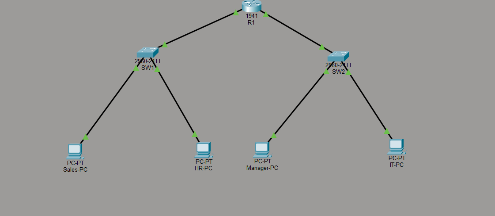

# Lab 02 - Two Network Routing

## Overview

This lab demonstrates routing between two different local area networks using a Cisco 1941 router.

## Topology

## Devices

- 1 Cisco 1941 Router
- 2 Cisco 2960 Switches
- 4 PCs

## Network Configuration

### Network 1
- Router: 192.168.10.1/24
- Sales-PC: 192.168.10.10
- HR-PC: 192.168.10.20

### Network 2
- Router: 192.168.20.1/24
- Manager-PC: 192.168.20.10
- IT-PC: 192.168.20.20

## Connectivity Test

- Successful ping inside Network 1
- Successful ping inside Network 2
- Successful routing between both networks

## Skills Learned

- Router configuration
- Interface configuration
- IP addressing
- Default Gateway
- Static IP configuration
- Basic routing
- End-to-end connectivity testing

## Files

- LAB-02-Two-Network-Routing.pkt
- Topology.png